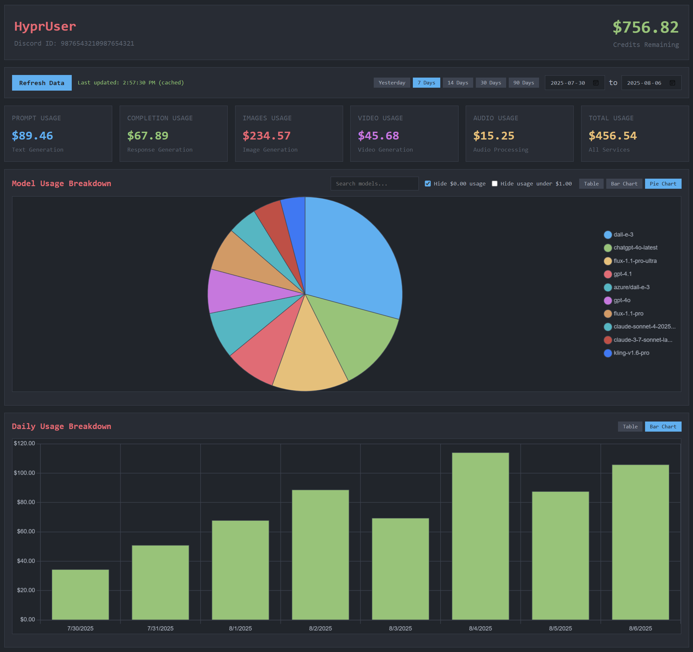

# HyprLab Usage Dashboard



A simple web dashboard to view your HyprLab API usage statistics with caching and table-based data visualization.

## Features

- **Multiple data views** - Tables, bar charts, and pie charts for data visualization
- **Smart caching** - Data is cached for 30 minutes to reduce API calls
- **Manual refresh** - Force refresh data when needed
- **Date range filtering** - View usage for specific time periods
- **Model filtering** - Search and filter models by name
- **Usage filtering** - Hide zero usage or small amounts
- **OneDark themed charts** - Beautiful charts that match the terminal aesthetic
- **Responsive design** - Works on desktop and mobile

## Quick Start (Local)

1.  **Install Dependencies**:
    ```bash
    pip install -r requirements.txt
    ```
2.  **Run the Application**:
    ```bash
    python app.py
    ```
3.  **Open in Browser**:
    Navigate to `http://127.0.0.1:5000`. The app will redirect you to a login page.
4.  **Enter API Key**:
    Enter your HyprLab API key. The key will be stored in your browser's local storage for future visits.

## Deploying to Replit

This dashboard is ready to be deployed on Replit.

1.  **Import Repository**:
    - Create a new Repl and import this repository directly from GitHub.
2.  **Run the Application**:
    - Click the "Run" button. Replit will automatically install the dependencies from `requirements.txt` and start the web server.
3.  **Access the Dashboard**:
    - A webview will open with the dashboard. You will be prompted to enter your HyprLab API key. Once entered, you can start using the dashboard.

## Date Range Options

- **Yesterday** - View usage for yesterday only
- **7 Days** - Last 7 days (default)
- **14 Days** - Last 14 days  
- **30 Days** - Last 30 days
- **90 Days** - Last 90 days
- **Custom Range** - Select specific start and end dates

## Data Visualization

### View Options
- **Table View** - Traditional tabular data display
- **Bar Chart** - Visual comparison of usage amounts
- **Pie Chart** - Proportional usage breakdown (model usage only)

### Chart Features
- **OneDark themed** - Charts match the terminal color scheme
- **Interactive tooltips** - Hover for detailed information
- **Responsive design** - Charts adapt to screen size
- **Real-time updates** - Charts update when filters change

## Filtering Options

- **Search models** - Type to filter models by name
- **Hide $0.00 usage** - Hide models with no usage (enabled by default)
- **Hide usage under $1.00** - Hide models with minimal usage

## Cache System

- Data is automatically cached for 30 minutes
- Cache status is shown next to the refresh button
- Green = cached data is valid
- Red = cached data has expired
- Click "Refresh Data" to force fetch new data

## Files

- `app.py` - The Flask web server that acts as a proxy.
- `templates/` - Contains the HTML files for the frontend.
- `static/` - Contains the CSS and JavaScript files.
- `requirements.txt` - Python dependencies for the backend.
- `.replit` & `replit.nix` - Configuration files for the Replit environment.

## Troubleshooting

- **401 Unauthorized Error**: This means your API key is invalid or has been rejected. Try generating a new key from the HyprLab dashboard and entering it again.
- **Failed to load data**: This could be an issue with the HyprLab API or your internet connection. Check the HyprLab status page and your connection.